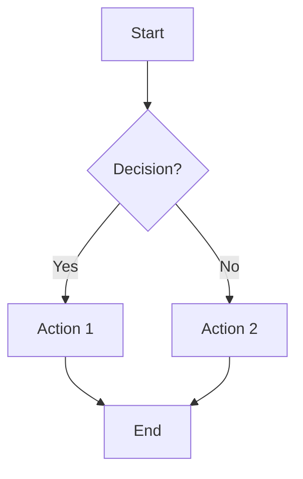
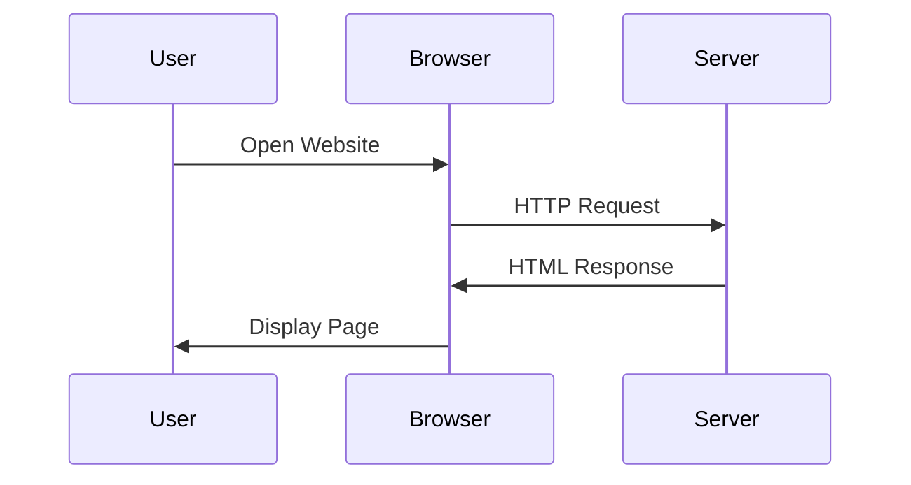
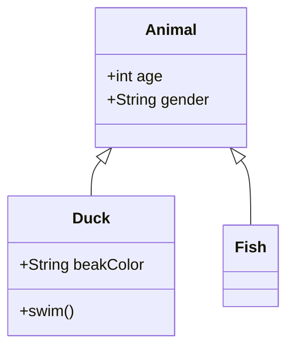

# 🧠 Personal Reference Hub

A modern, intuitive web application for creating and managing your personal knowledge base. Search, organize, and visualize any topic with explanations, diagrams, and images.

## ✨ Features

### 🔍 **Smart Search**
- **Instant Search**: Real-time filtering as you type
- **Multi-field Search**: Searches through titles, descriptions, and tags
- **Keyboard Shortcuts**: `Ctrl/Cmd + K` to focus search bar
- **Clear Results**: Visual feedback showing number of matches

### 📚 **Topic Management**
- **Rich Content**: Add titles, descriptions, diagrams, and images
- **Visual Diagrams**: Integrated Mermaid diagram support
- **Image Support**: External image URLs with error handling
- **Tagging System**: Organize topics with custom tags
- **Edit & Delete**: Full CRUD operations for all topics

### 🎨 **Modern UI/UX**
- **Clean Design**: Minimal, professional interface
- **Responsive Layout**: Works perfectly on desktop, tablet, and mobile
- **Expandable Cards**: Click to reveal detailed content
- **Dark Mode Ready**: Automatic dark mode support
- **Accessibility**: Full keyboard navigation and screen reader support

### 💾 **Data Management**
- **Local Storage**: All data saved in your browser
- **Export/Import**: Backup and restore your knowledge base
- **Auto-save**: Form data preserved during editing
- **Sample Data**: Comes with example topics (Proxy Servers, LLMs)

## 🚀 Getting Started

### Quick Start
1. **Download**: Clone or download this repository
2. **Open**: Open `index.html` in any modern web browser
3. **Explore**: Try searching for "proxy" or "LLM" to see sample topics
4. **Add Topics**: Click "Add New Topic" to start building your knowledge base

### No Installation Required
This is a pure client-side application - no server, database, or special software needed!

## 📖 How to Use

### Adding Your First Topic

1. **Click "Add New Topic"** in the top-left corner
2. **Fill in the details**:
   - **Title**: Name of your topic (e.g., "Machine Learning")
   - **Description**: Simple explanation in your own words
   - **Mermaid Diagram**: Optional visual diagram (see examples below)
   - **Image URL**: Optional relevant image
   - **Tags**: Comma-separated keywords for organization

3. **Save** and your topic appears in the grid!

### Creating Diagrams with Mermaid

Mermaid uses simple text to create beautiful diagrams. Here are some examples:

#### Flowchart

#### Sequence Diagram

#### Class Diagram

### Search Tips

- **Search everything**: The search looks through titles, descriptions, and tags
- **Use keywords**: Try searching for broad terms like "security" or "AI"
- **Clear search**: Click the ✕ button or press Escape to clear
- **Case insensitive**: Search works regardless of capitalization

### Managing Your Data

#### Export Your Topics
1. Click the **"Export"** button in the action bar
2. Choose where to save your `.json` file
3. Your entire knowledge base is backed up!

#### Import Topics
1. Click the **"Import"** button
2. Select a previously exported `.json` file
3. Your topics are restored instantly

## 🛠️ Technical Details

### Built With
- **HTML5**: Semantic, accessible markup
- **CSS3**: Modern styling with custom properties and grid layout
- **Vanilla JavaScript**: No frameworks - just clean, efficient code
- **Mermaid.js**: Beautiful diagram rendering
- **Inter Font**: Professional typography from Google Fonts

### Browser Support
- ✅ Chrome 90+
- ✅ Firefox 88+
- ✅ Safari 14+
- ✅ Edge 90+

### Storage
- Uses browser's `localStorage` for data persistence
- No data leaves your device unless you explicitly export it
- Storage limit: ~5-10MB (thousands of topics)

## 🎯 Use Cases

### 📚 **Study & Learning**
- Create visual explanations of complex concepts
- Build your own reference guide for exams
- Organize research notes with diagrams

### 💼 **Professional Development**
- Document new technologies you're learning
- Create quick reference guides for work
- Build a personal wiki of industry knowledge

### 🔧 **Technical Documentation**
- Explain system architectures with diagrams
- Document APIs and protocols
- Create troubleshooting guides

### 🌟 **Personal Knowledge**
- Collect interesting facts and explanations
- Organize hobby information
- Create visual guides for projects

## 🔧 Customization

### Adding Custom Styles
Edit `styles.css` to customize:
- Colors (CSS custom properties in `:root`)
- Typography and spacing
- Layout and responsive breakpoints

### Extending Functionality
The JavaScript code is modular and easy to extend:
- Add new search filters
- Implement additional export formats
- Create custom diagram types

## 📱 Mobile Experience

The application is fully responsive and touch-friendly:
- **Tap to expand** topic cards
- **Swipe gestures** for navigation
- **Mobile-optimized** forms and buttons
- **Zoom-friendly** diagrams and images

## 🔒 Privacy & Security

- **100% Client-Side**: No data sent to external servers
- **No Tracking**: No analytics or external scripts (except Mermaid CDN)
- **Your Data Stays Yours**: Everything stored locally in your browser
- **HTTPS Ready**: Works securely over encrypted connections

## 🤝 Contributing

Found a bug or have a feature request? This is your personal tool - customize it as needed!

Common modifications:
- **Color Themes**: Edit CSS custom properties
- **Additional Fields**: Modify the form and data structure
- **New Diagram Types**: Extend Mermaid configuration
- **Export Formats**: Add PDF or other export options

## 📄 License

This project is open source and available under the MIT License.

## 🎉 Sample Topics Included

The application comes with two example topics to get you started:

1. **Proxy Servers** - Complete with network diagram
2. **Large Language Models (LLMs)** - With architecture visualization

Feel free to edit or delete these once you've added your own topics!

---

**Happy Learning!** 🚀

Start building your personal knowledge base today and never forget an important concept again. 